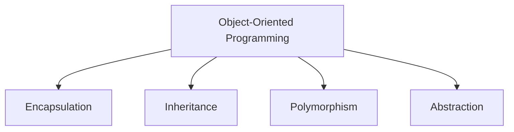
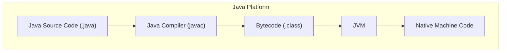

# Chapter 01 — 객체 지향 프로그래밍 개론

> **최종 수정일:** 2026-04-01

> **선수 지식**: [프로그래밍언어] 기본 프로그래밍 개념.
>
> **학습 목표**:
> 1. 객체 지향 프로그래밍 개념(클래스, 객체, 캡슐화)을 정의할 수 있다
> 2. Java 개발 환경을 설정할 수 있다
> 3. 기본 Java 프로그램을 작성하고 컴파일할 수 있다

---

## 목차

- [1. 객체 지향 프로그래밍이란?](#1-객체-지향-프로그래밍이란)
  - [1.1 프로그래밍 패러다임](#11-프로그래밍-패러다임)
  - [1.2 OOP의 4대 핵심 원칙](#12-oop의-4대-핵심-원칙)
- [2. Java 개요](#2-java-개요)
  - [2.1 역사와 설계 목표](#21-역사와-설계-목표)
  - [2.2 Java 플랫폼 아키텍처](#22-java-플랫폼-아키텍처)
  - [2.3 JDK, JRE, JVM](#23-jdk-jre-jvm)
- [3. Java 프로그램의 실행 과정](#3-java-프로그램의-실행-과정)
  - [3.1 컴파일과 인터프리팅](#31-컴파일과-인터프리팅)
  - [3.2 Write Once, Run Anywhere](#32-write-once-run-anywhere)
- [4. 개발 환경 설정](#4-개발-환경-설정)
- [5. 첫 번째 Java 프로그램](#5-첫-번째-java-프로그램)
- [요약](#요약)

---

<br>

## 1. 객체 지향 프로그래밍이란?

### 1.1 프로그래밍 패러다임

프로그래밍 패러다임은 코드를 구조화하고 사고하는 방식을 정의한다. 주요 패러다임은 다음과 같다:

| 패러다임 | 핵심 개념 | 대표 언어 |
|:---------|:---------|:----------|
| 절차적 | 단계별 명령 수행 | C, Pascal |
| 객체 지향 | 실세계 엔티티를 객체로 모델링 | Java, C++, Python |
| 함수형 | 수학 함수로서의 계산 | Haskell, Lisp |
| 선언적 | *어떻게* 가 아닌 *무엇을* 계산할지 기술 | SQL, Prolog |

> **핵심 포인트:** OOP는 소프트웨어를 데이터(필드)와 행위(메서드)를 모두 캡슐화한 상호작용하는 객체의 집합으로 모델링한다.

### 1.2 OOP의 4대 핵심 원칙



1. **캡슐화(Encapsulation)** — 데이터와 메서드를 하나로 묶고, 접근 제어자(`private`, `protected`, `public`)를 통해 직접 접근을 제한한다.
2. **상속(Inheritance)** — 기존 클래스로부터 새로운 클래스를 생성하여 코드 재사용을 촉진한다.
3. **다형성(Polymorphism)** — 하나의 인터페이스에 여러 구현을 가능하게 한다(메서드 오버로딩 및 오버라이딩).
4. **추상화(Abstraction)** — 구현 세부사항을 숨기고 필수적인 기능만 외부에 노출한다.

---

<br>

## 2. Java 개요

### 2.1 역사와 설계 목표

Java는 1995년 Sun Microsystems의 James Gosling이 개발하였다. 핵심 설계 목표는 다음과 같다:

- **단순성(Simple)** — 포인터, 다중 클래스 상속 등 복잡한 기능을 제거하였다.
- **객체 지향(Object-Oriented)** — 기본 자료형을 제외한 모든 것이 객체이다.
- **플랫폼 독립성(Platform-Independent)** — 바이트코드로 컴파일되어 모든 JVM에서 실행 가능하다.
- **보안성(Secure)** — 내장 보안 관리자와 바이트코드 검증기를 제공한다.
- **견고성(Robust)** — 강력한 타입 검사, 예외 처리, 가비지 컬렉션을 지원한다.
- **멀티스레드(Multithreaded)** — 동시성 프로그래밍을 기본적으로 지원한다.

### 2.2 Java 플랫폼 아키텍처



### 2.3 JDK, JRE, JVM

| 구성 요소 | 설명 |
|:----------|:-----|
| **JDK** (Java Development Kit) | 완전한 개발 환경: 컴파일러, 디버거, 도구 + JRE 포함 |
| **JRE** (Java Runtime Environment) | Java 프로그램 실행을 위한 런타임 라이브러리 + JVM |
| **JVM** (Java Virtual Machine) | 바이트코드를 실행하는 추상 머신; 플랫폼별로 구현됨 |

$$
\text{JDK} \supset \text{JRE} \supset \text{JVM}
$$

---

<br>

## 3. Java 프로그램의 실행 과정

### 3.1 컴파일과 인터프리팅

Java는 **하이브리드** 언어로, 컴파일과 인터프리팅을 모두 거친다:

1. **컴파일**: `javac MyProgram.java` 명령으로 `MyProgram.class`(바이트코드)를 생성한다.
2. **실행**: `java MyProgram` 명령으로 JVM을 시작하고, 바이트코드를 인터프리팅/JIT 컴파일한다.

```
Source Code (.java)  -->  Bytecode (.class)  -->  JVM  -->  Output
        [javac]                                  [java]
```

### 3.2 Write Once, Run Anywhere

바이트코드는 플랫폼 독립적이므로, 동일한 `.class` 파일이 Windows, macOS, Linux 등 호환되는 JVM이 있는 모든 운영 체제에서 실행된다.

> **핵심 포인트:** JVM은 컴파일된 바이트코드와 하위 하드웨어/운영 체제 사이에 추상화 계층을 제공하여 진정한 플랫폼 독립성을 가능하게 한다.

---

<br>

## 4. 개발 환경 설정

Java 개발을 위한 일반적인 설정 과정:

1. **JDK 설치** — Oracle에서 다운로드하거나 OpenJDK를 사용한다.
2. **환경 변수 설정** — `JAVA_HOME` 설정, `bin` 디렉토리를 `PATH`에 추가한다.
3. **IDE 선택** — IntelliJ IDEA, Eclipse, VS Code 또는 간단한 텍스트 편집기를 사용한다.
4. **설치 확인**:
   ```bash
   java -version
   javac -version
   ```

---

<br>

## 5. 첫 번째 Java 프로그램

최소한의 Java 프로그램 구조:

```java
public class HelloWorld {
    public static void main(String[] args) {
        System.out.println("Hello, OOP World!");
    }
}
```

주요 관찰 사항:
- 모든 Java 프로그램에는 최소 하나의 클래스가 필요하다.
- `main` 메서드가 진입점(entry point)이다: `public static void main(String[] args)`.
- `System.out.println()`은 콘솔에 텍스트를 출력한다.
- Java는 대소문자를 구분하며, 파일 이름은 public 클래스 이름과 일치해야 한다.

---

<br>

## 요약

| 개념 | 핵심 포인트 |
|:-----|:-----------|
| OOP | 소프트웨어를 데이터와 행위를 가진 상호작용하는 객체로 모델링 |
| 4대 원칙 | 캡슐화, 상속, 다형성, 추상화 |
| Java | 플랫폼 독립적이고, 객체 지향적이며, 컴파일 후 인터프리팅하는 언어 |
| JVM | 바이트코드를 실행하며 "Write Once, Run Anywhere"를 가능하게 함 |
| JDK vs JRE | JDK = 개발 도구 + JRE; JRE = 런타임 + JVM |
| 프로그램 구조 | 파일당 하나의 public 클래스; `main` 메서드가 진입점 |
