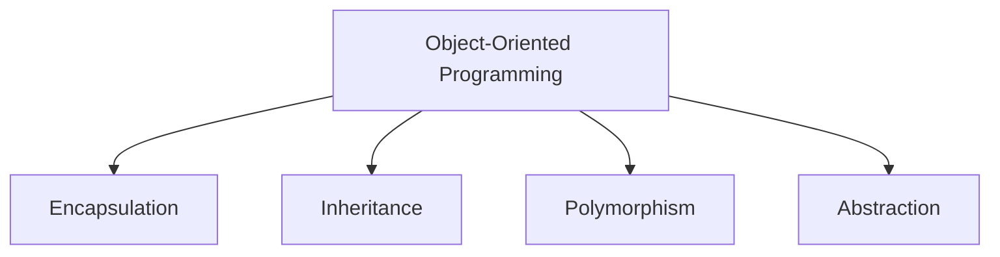
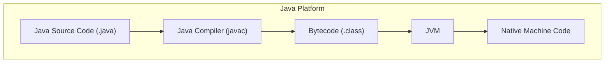

# Chapter 01 — Introduction to OOP

> **Last Updated:** 2026-04-01

> **Prerequisites**: [Programming Language] Basic programming concepts.
>
> **Learning Objectives**:
> 1. Define object-oriented programming concepts (class, object, encapsulation)
> 2. Set up a Java development environment
> 3. Write and compile basic Java programs

---

## Table of Contents

- [1. What is Object-Oriented Programming?](#1-what-is-object-oriented-programming)
  - [1.1 Programming Paradigms](#11-programming-paradigms)
  - [1.2 The Four Pillars of OOP](#12-the-four-pillars-of-oop)
- [2. Java Overview](#2-java-overview)
  - [2.1 History and Design Goals](#21-history-and-design-goals)
  - [2.2 Java Platform Architecture](#22-java-platform-architecture)
  - [2.3 JDK, JRE, and JVM](#23-jdk-jre-and-jvm)
- [3. How Java Programs Execute](#3-how-java-programs-execute)
  - [3.1 Compilation and Interpretation](#31-compilation-and-interpretation)
  - [3.2 Write Once, Run Anywhere](#32-write-once-run-anywhere)
- [4. Development Environment Setup](#4-development-environment-setup)
- [5. First Java Program](#5-first-java-program)
- [Summary](#summary)

---

<br>

## 1. What is Object-Oriented Programming?

### 1.1 Programming Paradigms

Programming paradigms define how we structure and reason about code. The major paradigms include:

| Paradigm | Key Idea | Example Languages |
|:---------|:---------|:------------------|
| Procedural | Step-by-step instructions | C, Pascal |
| Object-Oriented | Model real-world entities as objects | Java, C++, Python |
| Functional | Computation as mathematical functions | Haskell, Lisp |
| Declarative | Describe *what* to compute, not *how* | SQL, Prolog |

> **Key Point:** OOP models software as a collection of interacting objects, each encapsulating both data (fields) and behavior (methods).

### 1.2 The Four Pillars of OOP



1. **Encapsulation** — Bundling data and methods together; restricting direct access with access modifiers (`private`, `protected`, `public`).
2. **Inheritance** — Creating new classes from existing ones, promoting code reuse.
3. **Polymorphism** — A single interface with multiple implementations (method overloading and overriding).
4. **Abstraction** — Hiding implementation details and exposing only essential features.

---

<br>

## 2. Java Overview

### 2.1 History and Design Goals

Java was created by James Gosling at Sun Microsystems in 1995. Its core design goals are:

- **Simple** — Eliminated complex features like pointers and multiple inheritance of classes.
- **Object-Oriented** — Everything (except primitives) is an object.
- **Platform-Independent** — Compiled to bytecode that runs on any JVM.
- **Secure** — Built-in security manager and bytecode verifier.
- **Robust** — Strong type checking, exception handling, garbage collection.
- **Multithreaded** — Native support for concurrent programming.

### 2.2 Java Platform Architecture



### 2.3 JDK, JRE, and JVM

| Component | Description |
|:----------|:-----------|
| **JDK** (Java Development Kit) | Full development environment: compiler, debugger, tools + JRE |
| **JRE** (Java Runtime Environment) | Runtime libraries + JVM for executing Java programs |
| **JVM** (Java Virtual Machine) | Abstract machine that executes bytecode; platform-specific |

$$
\text{JDK} \supset \text{JRE} \supset \text{JVM}
$$

---

<br>

## 3. How Java Programs Execute

### 3.1 Compilation and Interpretation

Java is a **hybrid** language — it is both compiled and interpreted:

1. **Compile**: `javac MyProgram.java` produces `MyProgram.class` (bytecode).
2. **Execute**: `java MyProgram` launches the JVM, which interprets/JIT-compiles the bytecode.

```
Source Code (.java)  -->  Bytecode (.class)  -->  JVM  -->  Output
        [javac]                                  [java]
```

### 3.2 Write Once, Run Anywhere

Because bytecode is platform-independent, the same `.class` file runs on Windows, macOS, Linux, or any OS with a compatible JVM.

> **Key Point:** The JVM provides an abstraction layer between the compiled bytecode and the underlying hardware/OS, enabling true platform independence.

---

<br>

## 4. Development Environment Setup

Typical setup for Java development:

1. **Install JDK** — Download from Oracle or use OpenJDK.
2. **Set environment variables** — `JAVA_HOME`, add `bin` to `PATH`.
3. **Choose an IDE** — IntelliJ IDEA, Eclipse, VS Code, or even a simple text editor.
4. **Verify installation**:
   ```bash
   java -version
   javac -version
   ```

---

<br>

## 5. First Java Program

A minimal Java program structure:

```java
public class HelloWorld {
    public static void main(String[] args) {
        System.out.println("Hello, OOP World!");
    }
}
```

Key observations:
- Every Java program needs at least one class.
- The `main` method is the entry point: `public static void main(String[] args)`.
- `System.out.println()` prints text to the console.
- Java is case-sensitive; file name must match the public class name.

---

<br>

## Summary

| Concept | Key Point |
|:--------|:----------|
| OOP | Models software as interacting objects with data and behavior |
| Four Pillars | Encapsulation, Inheritance, Polymorphism, Abstraction |
| Java | Platform-independent, object-oriented, compiled-then-interpreted language |
| JVM | Executes bytecode; enables "Write Once, Run Anywhere" |
| JDK vs JRE | JDK = development tools + JRE; JRE = runtime + JVM |
| Program Structure | One public class per file; `main` method as entry point |
