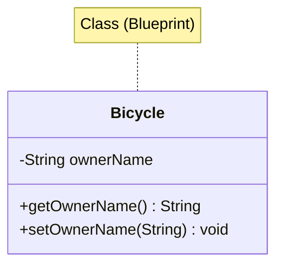

# Chapter 02 — 객체와 클래스

> **최종 수정일:** 2026-04-01

> **선수 지식**: [프로그래밍언어] Java 기초 (제1장). [객체지향] OOP 개념.
>
> **학습 목표**:
> 1. 필드, 메서드, 생성자를 가진 클래스를 설계할 수 있다
> 2. 객체를 생성하고 메서드를 호출할 수 있다
> 3. 캡슐화를 위한 접근 제어자를 적용할 수 있다

---

## 목차

- [1. Java의 객체와 클래스](#1-java의-객체와-클래스)
  - [1.1 객체란 무엇인가?](#11-객체란-무엇인가)
  - [1.2 클래스란 무엇인가?](#12-클래스란-무엇인가)
  - [1.3 객체와 클래스의 관계](#13-객체와-클래스의-관계)
- [2. 객체 생성](#2-객체-생성)
  - [2.1 선언과 인스턴스화](#21-선언과-인스턴스화)
  - [2.2 참조 변수](#22-참조-변수)
- [3. Java 표준 라이브러리 클래스](#3-java-표준-라이브러리-클래스)
  - [3.1 GUI 윈도우를 위한 JFrame](#31-gui-윈도우를-위한-jframe)
  - [3.2 대화 상자를 위한 JOptionPane](#32-대화-상자를-위한-joptionpane)
  - [3.3 문자열 조작](#33-문자열-조작)
  - [3.4 Date와 SimpleDateFormat](#34-date와-simpledateformat)
- [4. 프로그램 구조와 주석](#4-프로그램-구조와-주석)
- [요약](#요약)

---

<br>

## 1. Java의 객체와 클래스

### 1.1 객체란 무엇인가?

**객체(Object)**는 다음을 가지는 런타임 엔티티이다:
- **상태(State)** (필드/속성) — 객체가 보유하는 데이터
- **행위(Behavior)** (메서드) — 객체가 수행할 수 있는 연산
- **정체성(Identity)** — 다른 객체와 구별하는 고유한 참조

실세계 비유: `Car` 객체는 상태(색상, 속도), 행위(가속, 제동), 정체성(번호판)을 가질 수 있다.

### 1.2 클래스란 무엇인가?

**클래스(Class)**는 객체를 생성하기 위한 설계도(blueprint) 또는 템플릿이다. 클래스는 다음을 정의한다:
- 객체가 가질 데이터 멤버(필드)
- 객체가 수행할 수 있는 메서드

```java
public class Bicycle {
    private String ownerName;  // field (state)

    public String getOwnerName() {   // method (behavior)
        return ownerName;
    }

    public void setOwnerName(String name) {
        ownerName = name;
    }
}
```

### 1.3 객체와 클래스의 관계



- **클래스**는 구조를 정의하고, **객체**는 구체적인 인스턴스이다.
- 동일한 클래스로부터 여러 객체를 생성할 수 있으며, 각 객체는 자신만의 상태를 가진다.

---

<br>

## 2. 객체 생성

### 2.1 선언과 인스턴스화

Java에서 객체 생성은 두 단계로 이루어진다:

```java
// Step 1: 참조 변수 선언
JFrame myWindow;

// Step 2: 객체 인스턴스화(생성)
myWindow = new JFrame();

// 한 줄로 결합:
JFrame myWindow = new JFrame();
```

`new` 키워드는 힙(heap) 메모리에 공간을 할당하고 생성자를 호출한다.

### 2.2 참조 변수

참조 변수는 객체 자체가 아닌 객체의 **메모리 주소**를 저장한다.

```java
JFrame window1 = new JFrame();
JFrame window2 = window1;  // 두 변수가 동일한 객체를 가리킴
```

> **핵심 포인트:** 하나의 참조를 다른 참조에 대입하면 객체가 복사되는 것이 아니라, 두 변수가 메모리상의 동일한 인스턴스를 참조하게 된다.

---

<br>

## 3. Java 표준 라이브러리 클래스

### 3.1 GUI 윈도우를 위한 JFrame

`javax.swing.JFrame`은 제목 표시줄, 테두리, 콘텐츠 영역을 가진 윈도우를 나타낸다.

```java
JFrame myWindow = new JFrame();
myWindow.setSize(300, 200);
myWindow.setTitle("My First Java Program");
myWindow.setVisible(true);
```

주요 메서드:
| 메서드 | 설명 |
|:-------|:-----|
| `setSize(width, height)` | 윈도우 크기를 픽셀 단위로 설정 |
| `setTitle(String)` | 제목 표시줄 텍스트 설정 |
| `setVisible(boolean)` | 윈도우 표시 또는 숨기기 |
| `setDefaultCloseOperation(int)` | 윈도우 닫기 시 동작 정의 |

### 3.2 대화 상자를 위한 JOptionPane

`javax.swing.JOptionPane`은 입력과 출력을 위한 간단한 대화 상자를 제공한다:

```java
// 입력 대화 상자
String name = JOptionPane.showInputDialog(null, "Enter your name:");

// 메시지 대화 상자
JOptionPane.showMessageDialog(null, "Hello, " + name + "!");
```

### 3.3 문자열 조작

Java의 `String`은 불변(immutable)이다. 주요 연산은 다음과 같다:

```java
String fullName = "John Doe Smith";
String first = fullName.substring(0, fullName.indexOf(" "));
int length = fullName.length();
String upper = fullName.toUpperCase();
```

### 3.4 Date와 SimpleDateFormat

```java
import java.util.Date;
import java.text.SimpleDateFormat;

Date today = new Date();
SimpleDateFormat sdf = new SimpleDateFormat("MM/dd/yy");
String formatted = sdf.format(today);
```

---

<br>

## 4. 프로그램 구조와 주석

모든 Java 소스 파일은 다음과 같은 구조를 따른다:

```java
// 1. 패키지 선언 (선택 사항)
// 2. import 문
import javax.swing.*;

// 3. 클래스 정의
public class MyProgram {

    // 4. main 메서드 (진입점)
    public static void main(String[] args) {
        // 프로그램 로직
    }
}
```

주석 스타일:
- `//` — 단일 행 주석
- `/* ... */` — 다중 행 주석
- `/** ... */` — Javadoc 주석 (API 문서용)

---

<br>

## 요약

| 개념 | 핵심 포인트 |
|:-----|:-----------|
| 객체 | 상태, 행위, 정체성을 가진 클래스의 인스턴스 |
| 클래스 | 필드와 메서드를 정의하는 설계도 |
| `new` 키워드 | 메모리를 할당하고 생성자를 호출 |
| 참조 변수 | 객체 자체가 아닌 객체의 주소를 저장 |
| JFrame | GUI 윈도우를 생성하기 위한 Swing 클래스 |
| JOptionPane | 입출력 대화 상자를 제공 |
| String | 풍부한 조작 메서드를 가진 불변 문자 시퀀스 |
