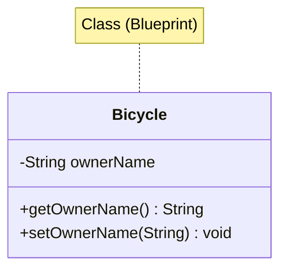

# Chapter 02 — Objects and Classes

> **Last Updated:** 2026-03-21

---

## Table of Contents

- [1. Objects and Classes in Java](#1-objects-and-classes-in-java)
  - [1.1 What is an Object?](#11-what-is-an-object)
  - [1.2 What is a Class?](#12-what-is-a-class)
  - [1.3 Relationship Between Objects and Classes](#13-relationship-between-objects-and-classes)
- [2. Creating Objects](#2-creating-objects)
  - [2.1 Declaration and Instantiation](#21-declaration-and-instantiation)
  - [2.2 Reference Variables](#22-reference-variables)
- [3. Java Standard Library Classes](#3-java-standard-library-classes)
  - [3.1 JFrame for GUI Windows](#31-jframe-for-gui-windows)
  - [3.2 JOptionPane for Dialogs](#32-joptionpane-for-dialogs)
  - [3.3 String Manipulation](#33-string-manipulation)
  - [3.4 Date and SimpleDateFormat](#34-date-and-simpledateformat)
- [4. Program Structure and Comments](#4-program-structure-and-comments)
- [Summary](#summary)

---

<br>

## 1. Objects and Classes in Java

### 1.1 What is an Object?

An **object** is a runtime entity that has:
- **State** (fields/attributes) — the data it holds
- **Behavior** (methods) — the operations it can perform
- **Identity** — a unique reference distinguishing it from other objects

Real-world analogy: A `Car` object might have state (color, speed), behavior (accelerate, brake), and identity (license plate).

### 1.2 What is a Class?

A **class** is a blueprint or template for creating objects. It defines:
- What data members (fields) an object will have
- What methods an object can perform

```java
public class Bicycle {
    private String ownerName;  // field (state)

    public String getOwnerName() {   // method (behavior)
        return ownerName;
    }

    public void setOwnerName(String name) {
        ownerName = name;
    }
}
```

### 1.3 Relationship Between Objects and Classes



- A **class** defines the structure; an **object** is a concrete instance.
- Multiple objects can be created from the same class, each with its own state.

---

<br>

## 2. Creating Objects

### 2.1 Declaration and Instantiation

Creating an object in Java involves two steps:

```java
// Step 1: Declare a reference variable
JFrame myWindow;

// Step 2: Instantiate (create) the object
myWindow = new JFrame();

// Combined in one line:
JFrame myWindow = new JFrame();
```

The `new` keyword allocates memory on the heap and calls the constructor.

### 2.2 Reference Variables

Reference variables store the **memory address** of an object, not the object itself.

```java
JFrame window1 = new JFrame();
JFrame window2 = window1;  // Both point to the same object
```

> **Key Point:** Assigning one reference to another does not copy the object — both variables refer to the same instance in memory.

---

<br>

## 3. Java Standard Library Classes

### 3.1 JFrame for GUI Windows

`javax.swing.JFrame` represents a window with a title bar, borders, and a content area.

```java
JFrame myWindow = new JFrame();
myWindow.setSize(300, 200);
myWindow.setTitle("My First Java Program");
myWindow.setVisible(true);
```

Key methods:
| Method | Description |
|:-------|:-----------|
| `setSize(width, height)` | Set window dimensions in pixels |
| `setTitle(String)` | Set the title bar text |
| `setVisible(boolean)` | Show or hide the window |
| `setDefaultCloseOperation(int)` | Define behavior on window close |

### 3.2 JOptionPane for Dialogs

`javax.swing.JOptionPane` provides simple dialog boxes for input and output:

```java
// Input dialog
String name = JOptionPane.showInputDialog(null, "Enter your name:");

// Message dialog
JOptionPane.showMessageDialog(null, "Hello, " + name + "!");
```

### 3.3 String Manipulation

Java `String` is immutable. Common operations:

```java
String fullName = "John Doe Smith";
String first = fullName.substring(0, fullName.indexOf(" "));
int length = fullName.length();
String upper = fullName.toUpperCase();
```

### 3.4 Date and SimpleDateFormat

```java
import java.util.Date;
import java.text.SimpleDateFormat;

Date today = new Date();
SimpleDateFormat sdf = new SimpleDateFormat("MM/dd/yy");
String formatted = sdf.format(today);
```

---

<br>

## 4. Program Structure and Comments

Every Java source file follows this structure:

```java
// 1. Package declaration (optional)
// 2. Import statements
import javax.swing.*;

// 3. Class definition
public class MyProgram {

    // 4. main method (entry point)
    public static void main(String[] args) {
        // Program logic here
    }
}
```

Comment styles:
- `//` — single-line comment
- `/* ... */` — multi-line comment
- `/** ... */` — Javadoc comment (for API documentation)

---

<br>

## Summary

| Concept | Key Point |
|:--------|:----------|
| Object | Instance of a class with state, behavior, and identity |
| Class | Blueprint defining fields and methods |
| `new` keyword | Allocates memory and calls the constructor |
| Reference variable | Stores the address of an object, not the object itself |
| JFrame | Swing class for creating GUI windows |
| JOptionPane | Provides input/output dialog boxes |
| String | Immutable character sequence with rich manipulation methods |
